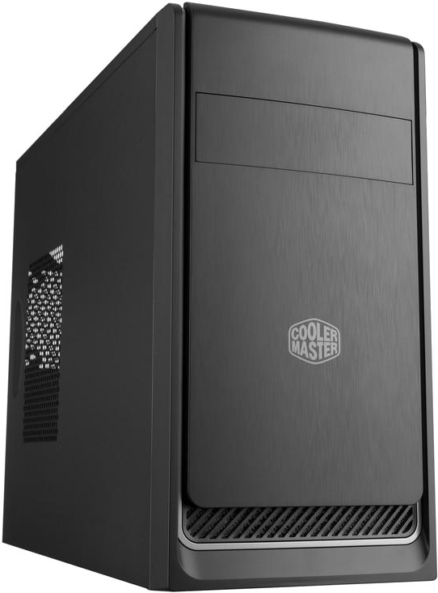
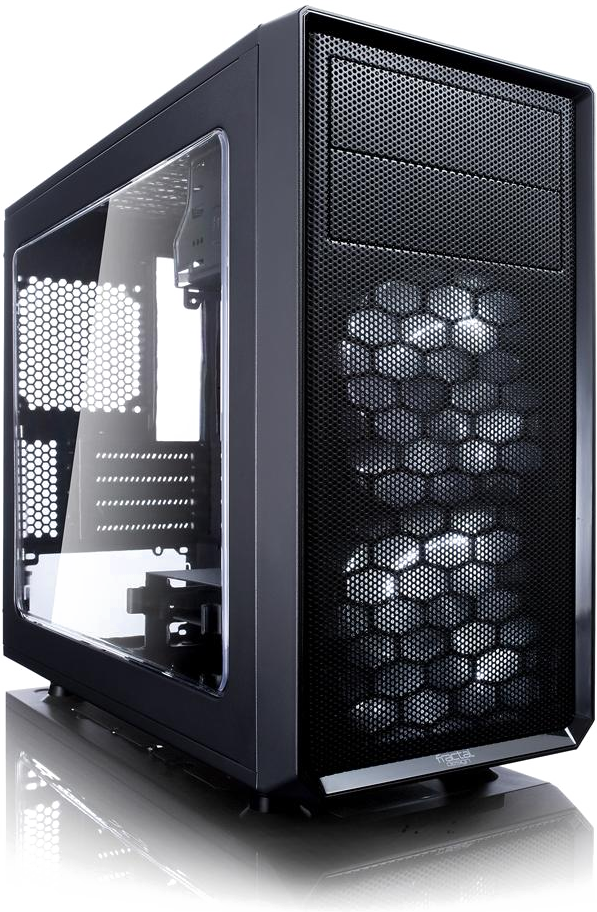

Select or customise one of the below computers, or commission a build to your requirements or exact specification.

* * *

## Choose a pre-built system

Technology moves at a fast pace, and these computers are built with the latest-generation* CPUs so that you can get the most out of them for a long time.

All systems come with **Windows 10 pre-installed**.

The following are additional components which, although not vital, you may wish to add. Without Wi-Fi, the computers will only be able to connect to the internet with an ethernet cable.

 - Mouse and keyboard for **£30**
 - Wi-Fi (b/g/n) for **£15**
 - CD / DVD Drive (R/W) for **£18**
 - Various monitors available on request

### Office

All office systems are built in the case above, but you can choose the level of components inside. The prices stated are for the **tower and setup only**.

#### Entry-level

 - Quad-core 4-thread CPU, 3.6 GHz
 - 8 GB RAM
 - 1 TB Hard Drive (1000 GB)

 Available for **£300**

#### Mid-range

 - Quad-core 8-thread CPU, 3.7 GHz
 - 8 GB RAM
 - 120 GB Solid State Drive
 - 1 TB Hard Drive (1000 GB)

 Available for **£350**

#### High-end

 - Quad-core 8-thread CPU, 3.7 GHz
 - 16 GB RAM
 - 500 GB Solid State Drive
 - 1 TB Hard Drive (1000 GB)

 Available for **£425**

### Gaming

All gaming computers are built in the case above, but with the level of components you choose below. Due to the volatile nature of the graphics card market, the GPU and price are subject to change.

#### Entry-level

 - Hex-core 12-thread CPU, 3.4 GHz (3.9 GHz boost)
 - GTX 1050 Ti GPU, 4 GB
 - 8 GB RAM
 - 1 TB Hard Drive (1000 GB)

 Available for **£475**

#### Mid-range

 - Hex-core 12-thread CPU, 3.4 GHz (3.9 GHz boost)
 - RX 5700 GPU, 8GB
 - 16 GB RAM
 - 1 TB Hard Drive (1000 GB)
 - 240 GB Solid State Drive

 Available for **£700**

#### High-end

 - Hex-core 12-thread CPU, 3.8 GHz (4.4 GHz boost)
 - RTX 2080 SUPER GPU, 8GB
 - 16 GB RAM
 - 1 TB Hard Drive (1000 GB)
 - 500 GB Solid State Drive

 Available for **£1250**

* * *

## Custom build

Have a specific requirement in mind? Contact me for a no-obligation consultation and quote, after which your computer can be assembled and set up.

* * *

\* Apart from the entry-level and mid-range gaming computers, which uses a previous generation CPU

* * *

## [back](../)